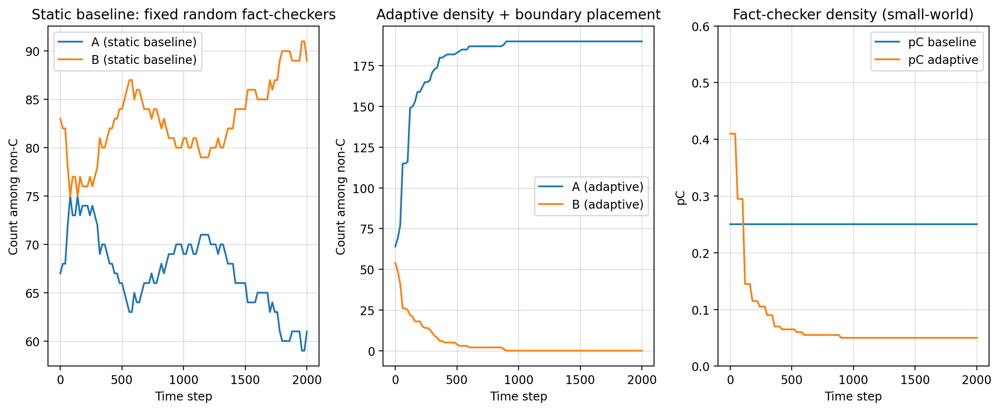

# Adaptive Boundary-Aware Fact-Checker Placement for Misinformation Suppression in Social Networks

[](https://www.python.org/)

A paper-aligned Python implementation of an adaptive, boundary-aware fact-checker allocation strategy for misinformation suppression in complex social networks.

## Associated Publication

This repository is associated with the following peer-reviewed article:

> M. T. Firouzjaee, **G. Naderi**, R. Gore, and N. Moghim,  
> “Adaptive Boundary-Aware Fact-Checker Placement for Misinformation Suppression in Social Networks,”  
> *Applied Sciences*, vol. 16, no. 10, Article 4740, 2026.

- **Published article:** [View on MDPI](https://www.mdpi.com/2076-3417/16/10/4740)
- **DOI:** [10.3390/app16104740](https://doi.org/10.3390/app16104740)
- **BibTeX:** See the [Citation](#citation) section.

## About This Repository

This repository originally began as a Game Theory course project based on a spatial evolutionary model of misinformation diffusion.

Following the development and publication of the associated article, the original implementation was refactored and aligned with the core methodology described in the paper.

The current implementation includes:

- Static random fact-checker placement as the baseline
- Adaptive regulation of fact-checker density
- Normalized boundary-aware placement
- Periodic fact-checker reallocation
- Probabilistic lasting correction
- Payoff-biased asynchronous imitation dynamics
- Small-world, scale-free, and random network topologies
- Single-seed visualization
- Multi-seed experiment execution
- CSV export for reproducibility analysis

## Repository Status

This repository provides a **paper-aligned implementation of the core simulation framework**.

It does not currently claim to reproduce every figure, table, ablation experiment, sensitivity analysis, echo-chamber metric, or statistical test reported in the published article.

## Model Overview

Each network node has a latent information-sharing strategy:

- `A`: shares truthful information
- `B`: shares misinformation
- `C`: temporarily acts as a fact-checker

Fact-checkers are treated as an intervention layer. Nodes assigned to `C` are excluded from ordinary imitation dynamics during their assignment.

The adaptive intervention combines:

1. **Adaptive density control**  
   The fact-checker ratio changes according to the current prevalence of misinformation.

2. **Boundary-aware placement**  
   Fact-checkers are assigned near interfaces between truthful and misinformation-sharing regions.

3. **Lasting correction**  
   When a node leaves the fact-checker set, its latent opinion may permanently change from `B` to `A` with a specified probability.

## Supported Network Topologies

The simulator supports:

- Watts–Strogatz small-world networks
- Barabási–Albert scale-free networks
- Erdős–Rényi random networks

## Default Parameters

| Parameter | Default value |
|---|---:|
| Number of nodes | 200 |
| Simulation steps | 2000 |
| Sampling interval | 20 |
| Control interval | 60 |
| Selection strength (`beta`) | 0.6 |
| Static baseline fact-checker ratio | 0.25 |
| Minimum adaptive ratio | 0.05 |
| Maximum adaptive ratio | 0.50 |
| Adaptive gain | 0.70 |
| Lasting-correction probability | 0.70 |

The default values can be modified in the `SimulationConfig` class.

## Installation

### Requirements

- Python 3.10 or newer
- Git

### Clone the Repository

```bash
git clone https://github.com/qazalnaderi/adaptive-fact-checker-placement.git
cd adaptive-fact-checker-placement
```

If the repository still uses its previous name, use:

```bash
git clone https://github.com/qazalnaderi/adaptive-fake-news-mitigation.git
cd adaptive-fake-news-mitigation
```

### Create a Virtual Environment

#### Windows PowerShell

```powershell
python -m venv .venv
.venv\Scripts\Activate.ps1
```

#### Linux or macOS

```bash
python3 -m venv .venv
source .venv/bin/activate
```

### Install Dependencies

```bash
pip install -r requirements.txt
```

## Quick Start

Run a single comparison on a small-world network:

```bash
python fake_news.py --mode single --topology small-world
```

Run on a scale-free network:

```bash
python fake_news.py --mode single --topology scale-free
```

Run on a random network:

```bash
python fake_news.py --mode single --topology random
```

Use a fixed seed for reproducibility:

```bash
python fake_news.py --mode single --topology small-world --seed 7
```

## Saving an Example Figure

Generate and save a reproducible small-world example:

```bash
python fake_news.py --mode single --topology small-world --seed 7 --output results/small_world_example.png --no-show
```

## Multi-Seed Experiment

Run 30 independent seeds across all supported network topologies:

```bash
python fake_news.py --mode experiment --runs 30 --output results/paper_experiment_summary.csv
```

The experiment evaluates both:

- Static random baseline
- Adaptive boundary-aware intervention

The output CSV contains one row for each topology, seed, and strategy.

## Output Metrics

The current implementation reports:

| Metric | Description |
|---|---|
| `final_fake_count` | Final number of observable misinformation nodes |
| `efficiency` | Normalized AUC-based misinformation-suppression score |
| `mean_fact_checker_budget` | Mean fraction of nodes assigned as fact-checkers |

## Example Output

The following figure shows an illustrative single-seed comparison on a Watts–Strogatz small-world network using seed `7`.



This figure represents one stochastic run. Quantitative conclusions should be based on the aggregated multi-seed experiment rather than a single simulation.

## Reproducibility Results

The stored 30-seed experimental output is available at:

[`results/paper_experiment_summary.csv`](results/paper_experiment_summary.csv)

The CSV includes results for:

- Small-world networks
- Scale-free networks
- Random networks
- Static baseline strategy
- Adaptive boundary-aware strategy

The stored outputs were generated using the default configuration included in this repository.

## Reproducibility Notes

For each experiment seed, the baseline and adaptive models use:

- The same network topology
- The same network realization
- The same initial latent opinions
- Separate stochastic dynamics streams

Because the simulation is stochastic, results should be evaluated using aggregated statistics across multiple independent seeds.

Exact agreement with every numerical result in the published article may depend on additional implementation and analysis details that are not yet included in this repository.

## Project Structure

```text
adaptive-fact-checker-placement/
├── fake_news.py
├── requirements.txt
└── results/
    ├── README.md
    ├── paper_experiment_summary.csv
    └── small_world_example.png
```

## Current Limitations

The current repository does not yet include:

- Suppression-time analysis
- Oscillation-range analysis
- Echo-chamber detection
- Ablation experiments
- Sensitivity analysis
- Observation-noise experiments
- Statistical hypothesis tests
- Automatic reproduction of every article figure and table

## Citation

When using this repository or its associated methodology, cite:

```bibtex
@article{firouzjaee2026adaptive,
  title   = {Adaptive Boundary-Aware Fact-Checker Placement for Misinformation Suppression in Social Networks},
  author  = {Firouzjaee, Mostafa Taghizade and Naderi, Ghazal and Gore, Ross and Moghim, Neda},
  journal = {Applied Sciences},
  volume  = {16},
  number  = {10},
  pages   = {4740},
  year    = {2026},
  doi     = {10.3390/app16104740}
}
```

## Authors

The associated article was authored by:

- Mostafa Taghizade Firouzjaee
- **Ghazal Naderi**
- Ross Gore
- Neda Moghim

For the complete author-contribution statement, refer to the published article.

## License

A software license has not yet been specified.

Before reusing or redistributing the code, please contact the repository maintainer or consult the license file once it is added.
